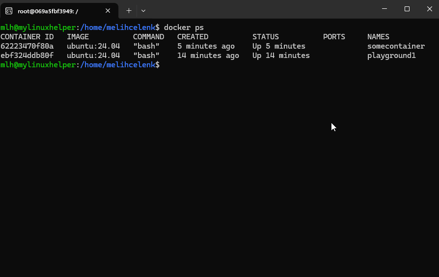

# MyLinuxHelper

A lightweight and modular collection of utility tools to simplify your Linux experience.

## Features

- **Interactive Command Menu**: Browse and explore all commands with the `mlh` interactive menu
- **Quick Directory Bookmarks**: Save and jump to frequently used directories with the `bookmark` command
- **Smart Docker Management**: Quickly enter running containers by name pattern with `mlh docker in`
- **Enhanced Command History**: View command history with dates, search commands, and filter by date range using `mlh history`
- **Fast File Search**: Find files quickly in current directory and subdirectories with the `search` command
- **Isolated Linux Containers**: Quickly launch and manage Linux containers with the `linux` command
- **Smart Package Manager**: Automatically detects and uses apt, yum, dnf, or other package managers with the `i` command
- **Advanced JSON Operations**: Validate and search JSON files with fuzzy matching and intelligent path navigation
- **Enhanced Directory Listing**: View detailed file and directory information with the `ll` command (ls -la shortcut)
- Lightweight and modular plugin system
- Easy installation and usage
- Extensible architecture for adding custom commands

## ⚡ Quick Setup
Run the command below:
```bash
bash -c "$(curl -fsSL https://raw.githubusercontent.com/melihcelenk/MyLinuxHelper/main/get-mlh.sh)" \
|| bash -c "$(wget -qO- https://raw.githubusercontent.com/melihcelenk/MyLinuxHelper/main/get-mlh.sh)"
```

After installation, you can configure a custom shortcut for the `bookmark` command (e.g., `bm`) by editing `~/.mylinuxhelper/mlh.conf` and running `./setup.sh` again. See the [Bookmark Alias Guide](docs/BOOKMARK_ALIAS_GUIDE.md) for details.

## 🚀 Usage

---

### 📋 `mlh` - Interactive Command Menu
Browse all available commands interactively:
```bash
# Show interactive menu
mlh

# Show version
mlh -v
mlh --version

# Docker shortcuts
mlh docker in <pattern>
```

**Interactive Menu Example:**
```
MyLinuxHelper - Available Commands
===================================

1. linux <name>              - Create and manage Linux containers
2. i <package>               - Install packages (auto-detects package manager)
3. isjsonvalid <file.json>   - Validate JSON files
4. ll [path]                 - Enhanced directory listing (ls -la)
5. mlh docker in <pattern>   - Enter running Docker container

Select [1-5, q]:
```

---

### 🐳 `mlh docker in` - Smart Container Access
Enter running Docker containers by name pattern:
```bash
# Enter container by name
mlh docker in web

# If multiple containers match, shows interactive menu:
# Multiple containers found matching 'mycontainer':
#
#   1. mycontainer-web (nginx:latest | Up 2 hours)
#   2. mycontainer-api (node:18 | Up 2 hours)
#   3. mycontainer-db (postgres:14 | Up 2 hours)
#
# Select container [1-3]: 1
```

---

### 📦 `linux` - Container Management

Launch and manage isolated Linux containers quickly:



```bash
# Create ephemeral container (auto-removed on exit)
linux mycontainer

# Create permanent container
linux -p mycontainer

# Stop container
linux -s mycontainer

# Delete container
linux -d mycontainer

# Use different base image
linux -i debian:12 mycontainer

# Bind mount directory
linux -m "$PWD:/workspace" -p mycontainer
```

---

### 🔖 `bookmark` - Quick Directory Bookmarks

Save and jump to frequently used directories instantly:


> **💡 Configurable Shortcut:** Configure your preferred alias (e.g., `bm`, `fav`, `goto`) in `~/.mylinuxhelper/mlh.conf`:
> ```bash
> BOOKMARK_ALIAS=bm
> ```
> Then run `./setup.sh` to apply. The alias works with all bookmark features!  
> Use `bm --help` to see examples with your configured shortcut.

```bash
# Save current directory (numbered bookmark)
bookmark .    # or: bm .

# Jump to bookmark 1 (most recent)
bookmark 1    # or: bm 1

# Save with a memorable name
bookmark . -n myproject    # or: bm . -n myproject

# Jump to named bookmark
bookmark myproject    # or: bm myproject

# Save with category for organization
bookmark . -n mlh in projects/linux    # or: bm . -n mlh in projects/linux
bookmark . -n api in projects/java     # or: bm . -n api in projects/java

# List all bookmarks (interactive TUI by default)
bookmark list    # or: bm list

# Non-interactive simple output
bookmark list -n    # or: bm list -n

# List specific category
bookmark list projects    # or: bm list projects

# Move bookmark to different category
bookmark mv mlh to tools    # or: bm mv mlh to tools

# Show last 5 numbered bookmarks
bookmark list 5    # or: bm list 5

# Rename numbered bookmark
bookmark 1 -n webapp    # or: bm 1 -n webapp

# Edit bookmark (name/path/category)
bookmark edit mlh    # or: bm edit mlh

# Remove bookmark
bookmark rm oldproject    # or: bm rm oldproject
bookmark rm 3              # or: bm rm 3

# Search bookmarks
bookmark find java    # or: bm find java

# Clear all numbered bookmarks
bookmark clear    # or: bm clear

# View help (dynamically shows your configured shortcut)
bookmark --help    # or: bm --help
```

**Key Features:**

- **Configurable shortcut alias**: Use `bm` (or your preferred shortcut) instead of typing `bookmark` every time! Configure in `~/.mylinuxhelper/mlh.conf`
- **Stack-based numbered bookmarks**: Quick access to last 10 directories (auto-rotating, auto re-numbering)
- **Named bookmarks**: Save important locations with memorable names
- **Hierarchical categories**: Organize bookmarks (e.g., `projects/linux`, `projects/java`)
- **Interactive menu by default**: Navigate with arrow keys, edit, delete, search in real-time (`bookmark list` - no `-i` flag needed!)
- **Category filtering**: List bookmarks by category
- **Smart search**: Find bookmarks by name, path, or category (`bookmark find <pattern>`)
- **Path validation**: Warns when bookmark path no longer exists
- **Name conflict detection**: Prevents conflicts with system commands (both for bookmarks and aliases)
- **Bookmark management**: Edit, remove, clear bookmarks easily
- **Instant navigation**: Jump to bookmarks without typing full paths
- **JSON storage**: Bookmark data stored at `~/.mylinuxhelper/bookmarks.json`
- **Dynamic help**: Help messages automatically adapt to show your configured shortcut

---

### 📜 `mlh history` - Enhanced Command History
View command history with dates, search, and filtering:
```bash
# Show last 100 commands (default)
mlh history

# Show all history
mlh history -a

# Show last 10 commands
mlh history 10

# Show detailed history with colors and formatting
mlh history -d

# Search for commands containing "docker"
mlh history -f docker

# Show specific command by number
mlh history -g 1432

# Show commands from specific date
mlh history -t 2025-10-20

# Show commands in date range
mlh history -t 2025-10-18..2025-10-20

# Configure settings (default limit, date tracking, display mode)
mlh history -c
```

**Key Features:**
- **Current session support**: Automatically includes commands from current session via wrapper function
- **Smart defaults**: Shows last 100 commands by default (configurable)
- **Show all**: Use `-a` to display entire history
- **Date tracking**: Shows when each command was executed (configurable)
- **Search functionality**: Find commands by pattern with `mlh history -f <pattern>`
- **Direct access**: Jump to specific command with `mlh history -g <number>`
- **Date filtering**: Filter by date or date range with `mlh history -t <date>`
- **Relative time support**: Use formats like `3d`, `20m`, `2h` for recent commands
- **Before offset**: Specify time offset with `-b` flag (e.g., `-t 20m -b 1h`)
- **Multiple display modes**: Simple (numbered with dates), Detailed (formatted), Minimal (plain)
- **Configurable defaults**: Set default limit, display mode, and enable/disable date tracking
- **Helpful messages**: When no results found, shows latest command timestamp with suggestions
- **Non-intrusive**: Doesn't affect the system `history` command

---

### 📥 `i` - Smart Package Installer
Automatically detects your package manager (apt, yum, dnf, etc.) and installs packages:
```bash
# Install a package
i nginx

# Install multiple packages
i git curl wget

# Show help
i --help
```

---

### 🔍 `mlh json` / `isjsonvalid` - JSON Operations
Advanced JSON validation and fuzzy search with intelligent path navigation:
```bash
# Quick validation (Yes/No output)
isjsonvalid data.json
# Output: Yes

# Detailed validation
isjsonvalid -d data.json
mlh json --isvalid data.json
# Output: ✓ Valid JSON

# Search for a field (fuzzy match, case-insensitive)
mlh json get name from users.json
# Output: "users"."name": "John"

# Partial key matching - finds "RequestedTags" with just "req"
mlh json get req from config.json
# Output: "RequestedTags": [...]

# Search with path hint (targeted search, no menu)
mlh json get settings.lang from config.json
# Output: "settings"."language": "en"

# Multiple matches - shows interactive menu
mlh json get user from data.json
# Found 3 matches for 'user':
# 1. "users": [...]
# 2. "username": "john"
# 3. "userProfile"."userId": "123"

# Show help
mlh json --help
```

**Key Features:**
- **Centralized validation**: Both `isjsonvalid` and `mlh json --isvalid` use the same engine
- **Flexible output modes**: Quick (Yes/No) or detailed (with colors and error messages)
- Searches ALL JSON keys (arrays, objects, scalars)
- Fuzzy and partial matching (e.g., `req` → `RequestedTags`)
- Path hints for targeted search
- Interactive menu for multiple matches
- Auto-installs `jq` if needed

---

### 📁 `ll` - Enhanced Directory Listing

Shortcut for `ls -la` to view detailed file information:
```bash
# List current directory
ll

# List specific directory
ll /var/log

# List with pattern
ll *.json
```

---

### 🔎 `search` - Fast File Search

Find files quickly in current directory and subdirectories:
```bash
# Search for file by name
search myfile

# Search for files with wildcard pattern
search "*.json"

# Search in specific directory
search config.js ./src

# Search for configuration files in /etc
search "*.conf" /etc
```


## 📦 Structure

```
/
├── get-mlh.sh          # Bootstrap installer (downloads repo)
├── setup.sh            # Main setup script (creates symlinks, configures PATH)
├── install.sh          # Universal package installer (provides 'i' command)
├── README.md           # User documentation with usage examples
├── CLAUDE.md           # Development documentation
├── TODO.md             # Feature roadmap and implementation checklist
├── LICENSE             # Project license
├── plugins/
│   ├── mlh.sh          # Interactive menu and command dispatcher
│   ├── mlh-bookmark.sh # Quick directory bookmarks (JSON-based, category support)
│   ├── mlh-docker.sh   # Docker shortcuts and container management
│   ├── mlh-history.sh  # Enhanced command history with dates, search, and filtering
│   ├── mlh-json.sh     # Advanced JSON search (delegates validation to isjsonvalid.sh)
│   ├── mlh-version.sh  # Version management and auto-update system
│   ├── mlh-about.sh    # Project information and about page
│   ├── linux.sh        # Launch and manage Docker containers
│   ├── search.sh       # Fast file search using find
│   ├── isjsonvalid.sh  # Centralized JSON validation with flexible output modes
│   ├── bookmark-alias.sh # Bookmark alias proxy (delegates to mlh-bookmark.sh)
│   └── ll.sh           # Shortcut for "ls -la"
├── docs/
│   ├── BOOKMARK_ALIAS_GUIDE.md        # Comprehensive alias setup guide
│   ├── BOOKMARK_QUICK_REFERENCE.md    # Quick reference for bookmark commands
│   ├── RELEASE_NOTES_v1.5.1.md        # Release notes for v1.5.1
│   ├── RELEASE_NOTES_v1.5.0.md        # Release notes for v1.5.0
│   ├── assets/
│   │   ├── MLH-Bookmark.gif           # Bookmark demo animation
│   │   └── MLH-Linux-Docker.gif       # Linux & Docker demo animation
│   └── config/
│       └── mlh.conf.example           # Example configuration file
└── tests/
    ├── test                                    # Main test runner (293 tests)
    ├── bookmark/
    │   ├── test-mlh-bookmark.sh                # 80 tests - Bookmark functionality
    │   ├── test-bookmark-alias.sh              # 28 tests - Alias configuration
    │   └── test-bookmark-alias-integration.sh  # 13 tests - Alias integration
    ├── test-mlh-history.sh                     # 34 tests - Command history
    ├── test-linux.sh                           # 15 tests - Container management
    ├── test-mlh-json.sh                        # 18 tests - JSON operations
    ├── test-mlh-docker.sh                      # 18 tests - Docker shortcuts
    ├── test-mlh.sh                             # 20 tests - Main dispatcher
    ├── test-search.sh                          # 16 tests - File search
    ├── test-isjsonvalid.sh                     # 18 tests - JSON validation
    ├── test-ll.sh                              # 10 tests - Directory listing
    ├── test-mlh-about.sh                       # 12 tests - About page
    ├── test-shellcheck.sh                      # 6 tests - Code quality validation
    ├── test-current-session.sh                 # 1 test - Session history
    └── test-time-debug.sh                      # 4 tests - Time parsing
```

## 🧪 Testing

MyLinuxHelper includes a comprehensive test suite with **293 tests** covering all major functionality.

### Running Tests

```bash
# Run all tests
./tests/test

# Run specific test suite
./tests/test mlh-history
./tests/test mlh-docker
./tests/test mlh-json
./tests/test linux
./tests/test search
./tests/test isjsonvalid
./tests/test ll
./tests/test mlh-about
./tests/test mlh
./tests/test shellcheck

# Run bookmark tests (subdirectory)
./tests/test bookmark/mlh-bookmark
./tests/test bookmark/bookmark-alias
./tests/test bookmark/bookmark-alias-integration
```

### Test Coverage

✅ **293 total tests** with **288 passed** (98.3% success rate)

> **Note:** Some tests gracefully skip if dependencies are missing (e.g., `jq` for JSON tests, `shellcheck` for code quality tests, `tmux` for interactive tests).

**Test Suites:**

1. **bookmark/mlh-bookmark.sh** (80 tests) - Bookmark functionality, interactive mode, categories
2. **bookmark/bookmark-alias.sh** (28 tests) - Alias configuration and validation
3. **bookmark/bookmark-alias-integration.sh** (13 tests) - Alias integration with setup.sh
4. **mlh-history.sh** (34 tests) - Command history, time parsing, filtering
5. **linux.sh** (15 tests) - Container management, Docker commands
6. **mlh-json.sh** (18 tests) - JSON search, validation, fuzzy matching
7. **mlh-docker.sh** (18 tests) - Container access, pattern matching
8. **mlh.sh** (20 tests) - Main dispatcher, routing, interactive menu
9. **search.sh** (16 tests) - File search, wildcards, error handling
10. **isjsonvalid.sh** (18 tests) - JSON validation engine, output modes
11. **ll.sh** (10 tests) - Directory listing wrapper
12. **mlh-about.sh** (12 tests) - Project information display
13. **shellcheck** (6 tests) - Code quality validation (requires shellcheck)
14. **current-session** (1 test) - Session history tracking

### Test Framework Features

- **✅ SKIP Support**: Tests gracefully skip when dependencies (like `jq`) are missing
- **✅ Syntax Error Detection**: Pre-validates test files before running to catch CRLF and syntax issues
- **✅ Color-coded Output**: Green (PASS), Yellow (SKIP), Red (FAIL) for easy reading
- **✅ Detailed Summary**: Shows Total, Passed, Skipped, Failed counts
- **✅ Modular Design**: Easy to add new test suites for plugins

### Code Quality

The codebase follows shell scripting best practices:

```bash
# Format all scripts with shfmt
shfmt -w .

# Check for common issues
shellcheck plugins/*.sh tests/*.sh
```

**Code Quality:**

- ✅ **ShellCheck Compliance**: All scripts pass ShellCheck validation (automated test suite)
- ✅ **Formatting**: All scripts formatted with `shfmt` for consistency
- ✅ **Best Practices**: Proper error handling with `set -euo pipefail`
- ✅ **Clean Syntax**: No unused variables, proper quoting, safe command execution

The test suite includes automated ShellCheck validation to ensure code quality across all scripts.

## 🔧 Development

### Code Formatting

MyLinuxHelper uses [`shfmt`](https://github.com/mvdan/sh) for consistent shell script formatting:

```bash
# Install shfmt (if not already installed)
# macOS
brew install shfmt

# Linux
go install mvdan.cc/sh/v3/cmd/shfmt@latest

# Format all scripts
shfmt -w .

# Check formatting without modifying
shfmt -d .
```

**Formatting Standards:**

- Indentation: Tabs
- Binary operators: Spaces around operators
- Redirect operators: No space before redirect
- Case indent: Aligned with case keyword

### Code Quality Checks

```bash
# Run ShellCheck on all scripts
shellcheck plugins/*.sh tests/*.sh

# Run tests after formatting
./tests/test

# Verify all tests pass
echo $?  # Should be 0
```

### Adding New Tests

1. Create a new test file in `tests/`:
   ```bash
   tests/test-<plugin-name>.sh
   ```

2. Follow the existing test structure:
   ```bash
   #!/usr/bin/env bash
   # Disable strict mode for tests
   set +euo pipefail 2>/dev/null || true
   set +e

   PLUGIN_SCRIPT="$ROOT_DIR/plugins/<plugin-name>.sh"

   # Test 1: Script exists
   if [ -f "$PLUGIN_SCRIPT" ]; then
     print_test_result "<plugin-name>.sh exists" "PASS"
   else
     print_test_result "<plugin-name>.sh exists" "FAIL"
   fi
   ```

3. Run the new test:
   ```bash
   ./tests/test <plugin-name>
   ```

### Fix Line Ending Issues

If you see syntax errors due to Windows line endings (CRLF):

```bash
# Fix a single file
sed -i 's/\r$//' tests/test-<name>.sh

# Fix all test files
find tests/ -name "*.sh" -exec sed -i 's/\r$//' {} \;

# Verify fix
file tests/test-<name>.sh
# Should show: "ASCII text executable" (not "with CRLF")
```

The test runner automatically detects syntax errors and shows helpful fix commands.

