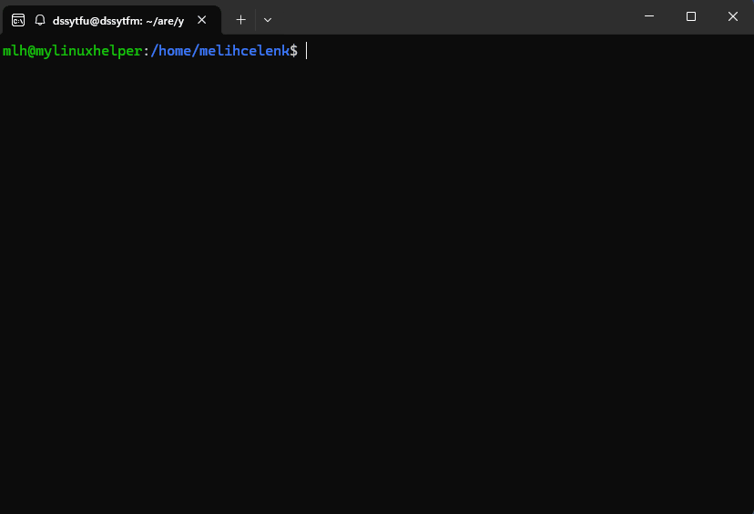

# Bookmark - Quick Reference Guide

Quick directory bookmarking and navigation system.



## 🚀 Quick Start

### Basic Operations

```bash
bookmark .                          # Save current directory (numbered)
bookmark 1                          # Jump to bookmark #1
bookmark . -n project               # Save with name
bookmark project                    # Jump to named bookmark
bookmark list                       # Interactive menu (default)
bookmark list -n                    # Non-interactive list
```

## 📋 Category-Based Usage

### Categorization

```bash
bookmark . -n mlh in tools          # Save with category
bookmark . -n api in projects/java  # Sub-category
bookmark list projects              # Filter by category
bookmark mv mlh to utils            # Move to category
```

### Search & Edit

```bash
bookmark find java                  # Search
bookmark edit mlh                   # Edit (name/path/category)
bookmark rm project                 # Remove
```

### List Operations

```bash
bookmark list 5                     # Show last 5 numbered bookmarks
bookmark clear                      # Clear all numbered bookmarks
```

## ⌨️ Interactive Mode (bookmark list)

### Navigation

```
↑/↓ or j/k                         # Navigate
Enter                               # Jump to bookmark
e                                   # Edit
d                                   # Delete
h                                   # Help
q                                   # Quit
```

## 💡 Tips

### Quick Workflow

1. Categorize projects: `bookmark . -n X in projects`
2. Use interactive menu: `bookmark list`
3. Navigate with arrow keys and press Enter

### Organization

- **Hierarchical categories**: Sub-categories like `aaa/bbb/ccc`
- **Name conflict prevention**: System commands automatically blocked
- **Automatic path validation**: ⚠ marks deleted paths

## 📦 Features

- **Stack-based numbered bookmarks**: Max 10, LIFO (last added becomes #1)
- **Named bookmarks**: Unlimited, persistent
- **Hierarchical categories**: Multi-level organization
- **Fuzzy search**: Smart search with `bookmark find`
- **JSON storage**: `~/.mylinuxhelper/bookmarks.json`
- **Path validation**: Warnings for deleted directories

## 📊 Command Reference (Alphabetical)

| Command                         | Description              | Example                     |
|---------------------------------|--------------------------|-----------------------------|
| `bookmark .`                    | Save current directory   | `bookmark .`                |
| `bookmark . -n <name>`          | Save with name           | `bookmark . -n myapp`       |
| `bookmark . -n <name> in <cat>` | Save with category       | `bookmark . -n api in java` |
| `bookmark <number>`             | Jump to numbered         | `bookmark 1`                |
| `bookmark <name>`               | Jump to named            | `bookmark myapp`            |
| `bookmark clear`                | Clear numbered bookmarks | `bookmark clear`            |
| `bookmark edit <name>`          | Edit bookmark            | `bookmark edit myapp`       |
| `bookmark find <pattern>`       | Search bookmarks         | `bookmark find shop`        |
| `bookmark list`                 | Interactive menu         | `bookmark list`             |
| `bookmark list -n`              | Non-interactive list     | `bookmark list -n`          |
| `bookmark list <category>`      | Filter by category       | `bookmark list java`        |
| `bookmark list <N>`             | Last N numbered          | `bookmark list 5`           |
| `bookmark mv <name> to <cat>`   | Move to category         | `bookmark mv api to tools`  |
| `bookmark rm <name\|number>`    | Remove bookmark          | `bookmark rm oldapp`        |
| `bookmark --help`               | Show help                | `bookmark --help`           |

## 🎯 Usage Scenarios

### Scenario 1: Quick Switching Between Project Directories

```bash
# Categorize projects
bookmark . -n frontend in work/projects
bookmark . -n backend in work/projects
bookmark . -n docs in work/projects

# Jump with interactive menu
bookmark list
```

### Scenario 2: Remembering Temporary Directories

```bash
# Quick save
bookmark .                          # Saved as #1

cd /etc/nginx/sites-available
# ... do work ...

# Jump back
bookmark 1
```

### Scenario 3: Categorized Workspace

```bash
# Organize by category
bookmark . -n api in java/backend
bookmark . -n web in js/frontend
bookmark . -n mobile in kotlin/android

# Filter by category
bookmark list java                  # Only java category
bookmark find backend               # All containing "backend"
```

### Scenario 4: Quick Search and Navigation

```bash
# Can't remember where a project is
bookmark find shop                  # All bookmarks containing "shop"
bookmark list                       # Interactive search + selection
```

## 🔧 Advanced Tips

### Convert Numbered Bookmark to Named

```bash
cd /long/path/project
bookmark .                          # Saved as #1
bookmark 1 -n myproject             # Convert to named bookmark
```

### Change Category

```bash
bookmark mv myproject to archive    # Move to category
```

### Bulk Cleanup

```bash
bookmark clear                      # Delete all numbered bookmarks (asks confirmation)
```

## 🎨 Custom Alias

Create a shorter command alias (e.g., `bm`):

```bash
echo "BOOKMARK_ALIAS=bm" > ~/.mylinuxhelper/mlh.conf
./setup.sh
source ~/.bashrc

bm .                                # Save
bm list                             # Interactive menu
bm project                          # Jump
```

See `docs/BOOKMARK_ALIAS_GUIDE.md` for detailed configuration.

## 🐛 Troubleshooting

### Bookmark not working

```bash
./setup.sh                          # Reload wrapper function
source ~/.bashrc                    # Reload shell
```

### JSON file corrupted

```bash
cat ~/.mylinuxhelper/bookmarks.json | jq .  # Validate
# If corrupted, restore from backup or delete file (will be recreated)
```

### Path no longer exists warning

```bash
bookmark edit myproject             # Update path
# or
bookmark rm myproject               # Remove
```

---

**Last Updated**: 2025-11-08  
**Version**: MyLinuxHelper v1.5.0+
